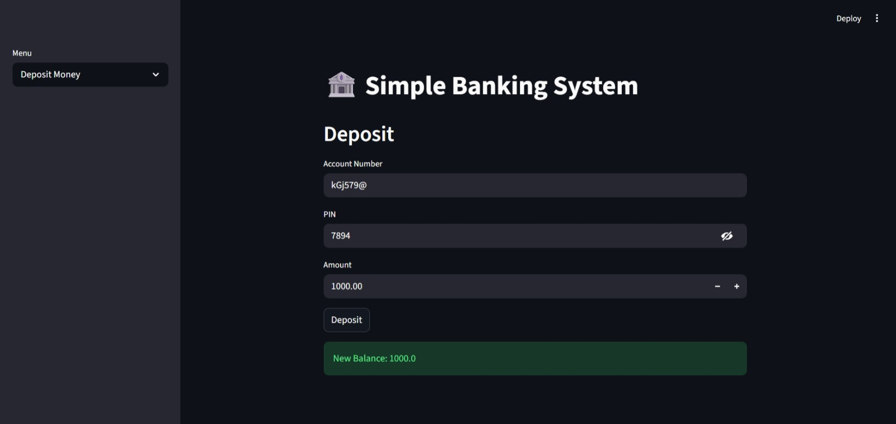

# Bank Management System (Streamlit)

A simple **Bank Management System** built using **Python and Streamlit**.  
This application allows users to create bank accounts, deposit and withdraw money, update account details, and manage their accounts through an interactive web interface.

---

## Project Preview



---

## Features

- Create a new bank account  
- Deposit money into an account  
- Withdraw money from an account  
- View account details  
- Update account information  
- Delete an account  

---

## Technologies Used

- Python  
- Streamlit  
- JSON (for storing user data)

---

## Project Structure

```
bank-management-streamlit
│
├── assets
│   └── app.preview.jpeg
│
├── app.py
├── bank.py
├── data.json
├── .gitignore
├── LICENSE
└── README.md
```

---

## Installation

Clone the repository:

```
git clone https://github.com/prathameshjumle/bank-management-streamlit.git
```

Move into the project directory:

```
cd bank-management-streamlit
```

Install dependencies:

```
pip install streamlit
```

---

## Run the Application

Start the Streamlit server:

```
streamlit run app.py
```

Then open your browser at:

```
http://localhost:8501
```

---

## Future Improvements

- Add user authentication  
- Implement transaction history  
- Use a proper database like SQLite or PostgreSQL  
- Add data visualization dashboards  

---

## Author

**Prathamesh Jumle**

GitHub:  
https://github.com/prathameshjumle

---

## License

This project is licensed under the **MIT License**.